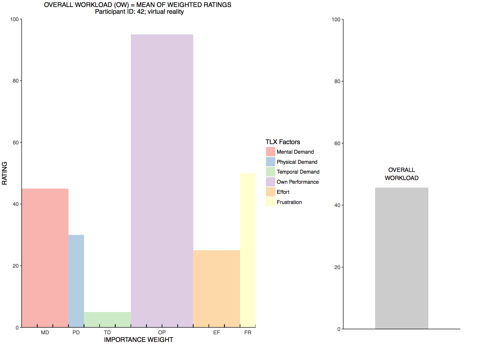

# NASA TLX - R analysis and visualization

This is a R function, incl. demonstration script, in order to analyze and visualize data collected with the [NASA Task Load Index (TLX)](https://humansystems.arc.nasa.gov/groups/tlx/) workload assessment questionnaire using the R programming language.

The function takes collected data for one test subject and one task, analyzes the data, and visualizes the workload as well as the individual workload factors (mental demand, physical demand, temporal demand, own performance, effort, frustration) in a plot according to the [NASA TLX Instruction Manual](https://humansystems.arc.nasa.gov/groups/tlx/downloads/TLX_pappen_manual.pdf) (see page 7). The demo script presents some simple usage examples, incl. the export of the visualization in .pdf format.

## Dependencies
This function has been built using the following specifications:

* [R](https://www.r-project.org) 3.4.0
* [RStudio](https://www.rstudio.com) 1.0.153 (OS X)
* [gridExtra](https://cran.r-project.org/web/packages/gridExtra/) 2.2.1
* [ggplot2](https://cran.r-project.org/web/packages/ggplot2/) 2.2.1

## Example visualization

## Usage
Please have a look at `tlx_individual_demo.R` for example usage descriptions.

## Known issues
1. Bar generation in TLX factor chart might not be optimal if `weight` or `rawRating` value are equal to `0`.

## License
MIT License, see [LICENSE.md](LICENSE.md)
